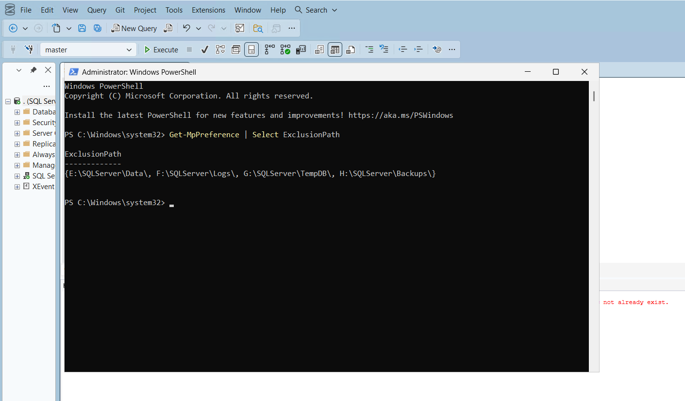
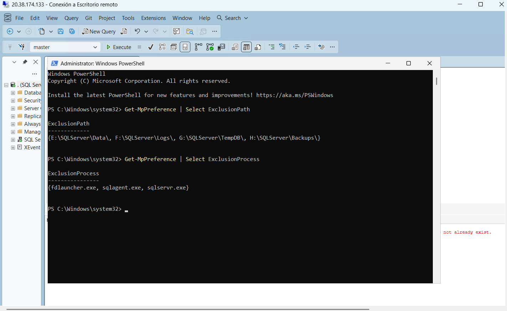

# Antimalware SQL Server

## Objetivo

Documentar la configuración del antimalware para evitar interferencia con archivos críticos de SQL Server.

## Configuración requerida

Se deben excluir del análisis en tiempo real las rutas utilizadas por SQL Server para datos, logs, TempDB, backups y auditoría.

## Exclusiones recomendadas

| Ruta | Uso |
|---|---|
| `E:\SQLServer\Data\SIGAU` | MDF, NDF y Memory Optimized |
| `F:\SQLServer\Logs\SIGAU` | Transaction Logs |
| `G:\SQLServer\TempDB` | TempDB |
| `H:\SQLServer\Backups\SIGAU` | Backups |
| `H:\SQLServer\Audit\SIGAU` | Auditoría |

## Evidencias



## Exclusiones de procesos

También se configuraron exclusiones para los principales procesos utilizados por SQL Server:

- `sqlservr.exe`
- `sqlagent.exe`
- `fdlauncher.exe`

Estas exclusiones permiten que Microsoft Defender no analice continuamente los procesos del motor mientras se encuentran en ejecución, evitando afectar el desempeño del servidor.

### Evidencia



## Verificación

La configuración fue verificada mediante PowerShell utilizando el siguiente comando:

```powershell
Get-MpPreference
```

El resultado confirmó que tanto las rutas excluidas como los procesos registrados corresponden a la configuración recomendada para SQL Server.

## Resultado

Con esta configuración, Microsoft Defender protege el sistema operativo sin interferir con la operación normal de SQL Server, cumpliendo con las buenas prácticas de administración y hardening recomendadas por Microsoft.
