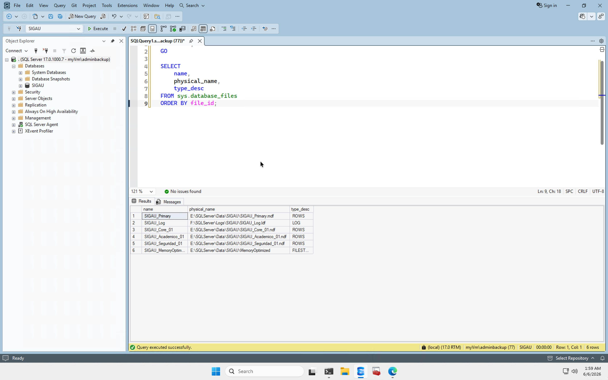
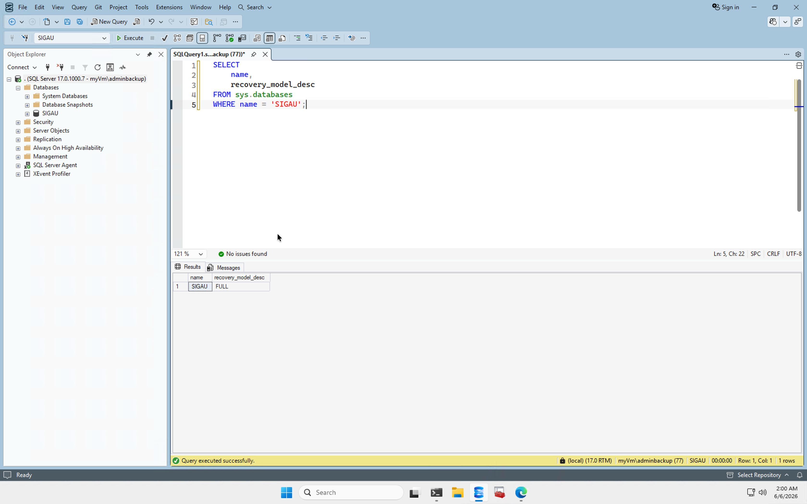

# Arquitectura del Proyecto SIGAU

## Descripción general

SIGAU fue diseñado sobre Microsoft SQL Server 2025 con una arquitectura lógica por esquemas y una arquitectura física basada en filegroups y unidades separadas.

El objetivo de esta arquitectura es separar responsabilidades, facilitar mantenimiento, mejorar trazabilidad y aplicar mejores prácticas de administración de bases de datos.

## Arquitectura lógica

Flujo lógico:

Usuarios  
↓  
Roles de seguridad  
↓  
Vistas y procedimientos almacenados  
↓  
Esquemas de negocio  
↓  
Tablas  
↓  
Filegroups  
↓  
Almacenamiento físico

## Esquemas implementados

### core

Contiene datos base institucionales:

- Persona
- Sede
- TipoIdentificacion
- TipoDireccion
- TipoMedioContacto
- IdentificacionPersona
- DireccionPersona
- MedioContactoPersona

### academico

Contiene la operación académica:

- Escuela
- PlanEstudio
- Profesor
- Estudiante
- PeriodoLectivo
- Curso
- RequisitoCurso
- Grupo
- Matricula
- HistorialAcademico

### admin

Contiene la operación administrativa:

- UnidadAdministrativa
- Administrativo
- Nombramiento

### seguridad

Contiene objetos de seguridad:

- UsuarioSede
- BitacoraAcceso
- Función de filtrado RLS
- Políticas de seguridad

### api

Contiene objetos de integración:

- ConsultaExterna
- Procedimiento de consumo REST
- Procedimiento de exportación JSON

### consulta

Contiene vistas de acceso para usuarios finales. La rúbrica exige que las consultas se realicen mediante vistas, por lo que se creó al menos una vista por tabla.

## Arquitectura física

La base de datos utiliza múltiples filegroups:

| Filegroup | Uso |
|---|---|
| PRIMARY | Archivo principal |
| FG_SIGAU_CORE | Datos institucionales principales |
| FG_SIGAU_ACADEMICO | Datos académicos |
| FG_SIGAU_SEGURIDAD | Datos de seguridad |
| FG_SIGAU_MEMORY_OPTIMIZED | Objetos In-Memory OLTP |

## Distribución por unidades

| Unidad | Uso |
|---|---|
| E: | MDF, NDF y Memory Optimized |
| F: | Transaction Logs |
| G: | TempDB |
| H: | Backups y Auditoría |

Evidencia:

## Recovery Model

SIGAU utiliza Recovery Model FULL para soportar estrategias de respaldo y recuperación.

Evidencia:

## In-Memory OLTP

La tabla `seguridad.BitacoraAcceso` fue creada como tabla In-Memory con durabilidad `SCHEMA_AND_DATA`.

Esto permite registrar eventos de acceso con menor latencia y cumple el requisito de gestión In-Memory.

## Backup y Restore

La base de datos fue respaldada mediante `BACKUP DATABASE` y restaurada en una base de prueba llamada `SIGAU_RESTORE_TEST`.

Evidencias:

## Documentos relacionados

- [Modelo de datos](Modelo_Datos.md)
- [Seguridad](Seguridad.md)
- [Discos y LUNs](../06_azure/Discos.md)
- [Evidencias](Evidencias.md)
- [Azure SQL Database](Azure_SQL_Database.md)
- [Vector Search](Vector_Search.md)
- [External API Calls](External_API_Calls.md)
- [Expresiones Regulares](Regex_Avanzado.md)