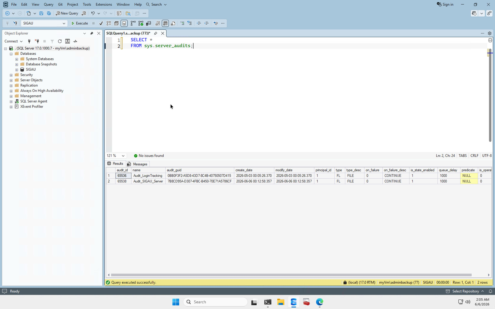
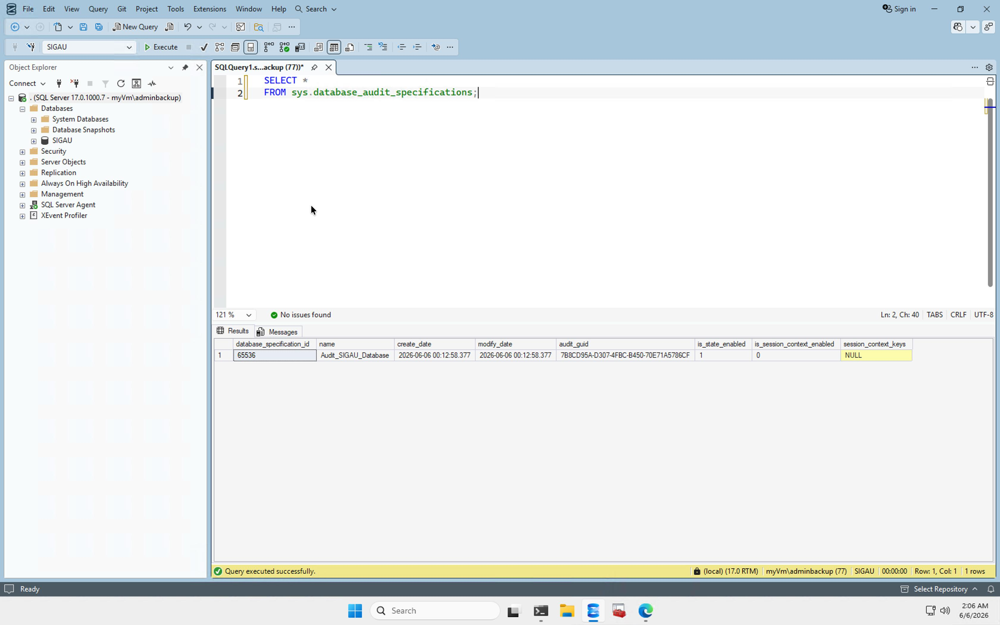

# Auditoría SQL Server

## Objetivo

Registrar y conservar eventos relevantes de seguridad y operación ocurridos en la instancia de SQL Server y en la base de datos SIGAU.

La auditoría permite identificar quién realizó una acción, sobre qué base de datos u objeto, si la operación fue exitosa y cuál fue la sentencia ejecutada.

## Auditorías configuradas

Se verificaron dos auditorías de servidor activas.

| Auditoría | Destino | Estado | Queue Delay | Acción ante fallo |
|---|---|---|---:|---|
| `Audit_LoginTracking` | Archivo | `STARTED` | 1000 ms | `CONTINUE` |
| `Audit_SIGAU_Server` | Archivo | `STARTED` | 1000 ms | `CONTINUE` |

Ambas auditorías se encuentran habilitadas y en ejecución.

## Auditoría de inicios de sesión

La especificación de servidor `Audit_LoginTracking_Spec` está asociada a `Audit_LoginTracking`.

Registra los siguientes grupos de acciones:

- `SUCCESSFUL_LOGIN_GROUP`
- `FAILED_LOGIN_GROUP`

Los eventos exitosos y fallidos son almacenados en archivos ubicados en:

`H:\SQLServer\Audit\`

La configuración permite detectar accesos válidos e intentos de autenticación rechazados.

## Auditoría de la base de datos SIGAU

La especificación `Audit_SIGAU_Database` está asociada a la auditoría `Audit_SIGAU_Server`.

Se encuentra habilitada y registra las siguientes acciones:

| Acción auditada | Alcance |
|---|---|
| `SELECT` | Consultas de datos |
| `INSERT` | Inserción de registros |
| `UPDATE` | Modificación de registros |
| `DELETE` | Eliminación de registros |
| `SCHEMA_OBJECT_CHANGE_GROUP` | Cambios en objetos del esquema |
| `DATABASE_PERMISSION_CHANGE_GROUP` | Cambios de permisos |
| `DATABASE_PRINCIPAL_CHANGE_GROUP` | Cambios de usuarios y roles |

Se registran tanto operaciones exitosas como intentos fallidos.

## Almacenamiento

Los archivos de auditoría de SIGAU se generan en:

`H:\SQLServer\Audit\SIGAU\`

La auditoría principal utiliza la siguiente configuración:

| Propiedad | Valor |
|---|---|
| Tipo | `FILE` |
| Estado | `STARTED` |
| Tamaño máximo por archivo | 100 MB |
| Cantidad máxima de archivos | 10 |
| Queue Delay | 1000 ms |
| Acción ante fallo | `CONTINUE` |

La ruta de auditoría está incluida entre las exclusiones de Microsoft Defender para evitar interferencias con la escritura de los archivos `.sqlaudit`.

## Verificación funcional

La verificación se realizó mediante las vistas del sistema:

- `sys.server_audits`
- `sys.dm_server_audit_status`
- `sys.server_audit_specifications`
- `sys.database_audit_specifications`

Los eventos almacenados se consultaron mediante:

    sys.fn_get_audit_file

La consulta confirmó eventos reales asociados a SIGAU, incluyendo:

- accesos a datos;
- inserciones;
- actualizaciones;
- creación y eliminación de objetos;
- cambios de permisos;
- intentos de consulta rechazados.

Entre los eventos verificados se encontraron más de 27 000 operaciones `SELECT` exitosas y varios intentos fallidos registrados correctamente.

También se encontraron eventos de la base `SIGAU_RESTORE_TEST`, generados durante las pruebas de restauración.

## Interpretación de resultados

El campo `succeeded` permite distinguir entre:

- `1`: operación exitosa;
- `0`: operación rechazada o fallida.

Los eventos fallidos confirman que SQL Server Audit registra también intentos bloqueados por los controles de seguridad.

## Evidencias

### Auditoría de servidor

### Auditoría de base de datos

## Objetos relacionados

- `Audit_LoginTracking`
- `Audit_LoginTracking_Spec`
- `Audit_SIGAU_Server`
- `Audit_SIGAU_Database`

## Resultado

La auditoría de SQL Server está implementada, habilitada y generando archivos con eventos reales de la instancia y de la base de datos SIGAU.

## Estado

Implementado, documentado y verificado en la VM.
