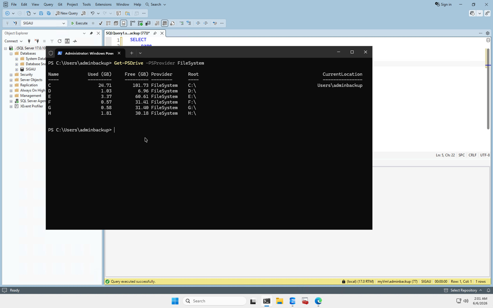
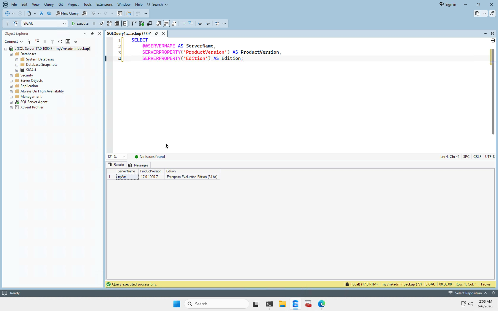
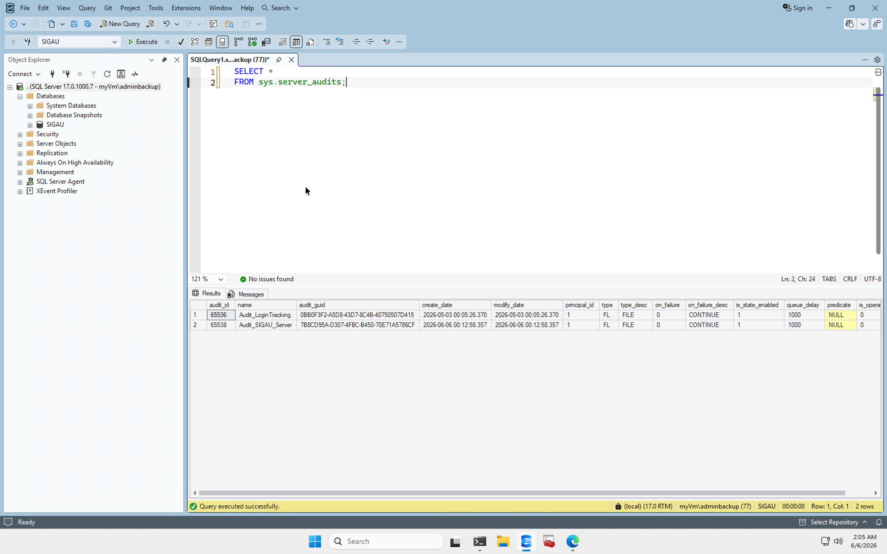
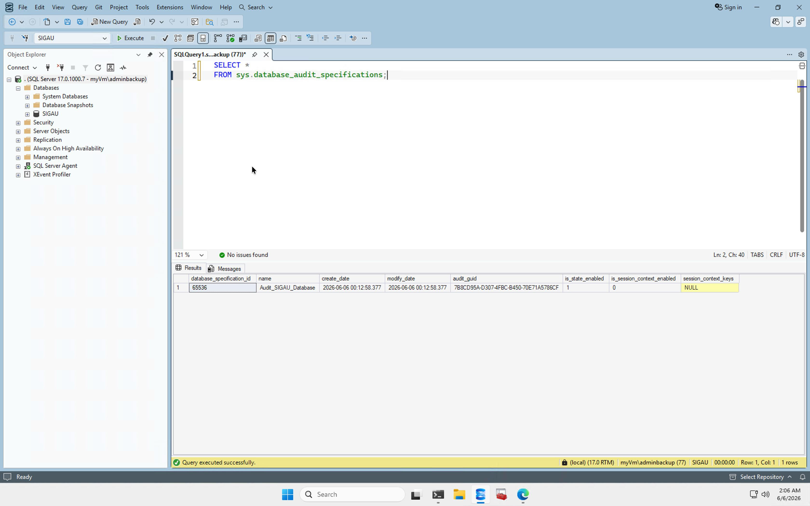
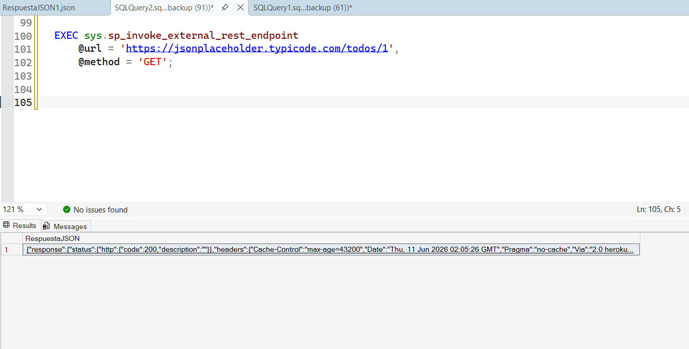
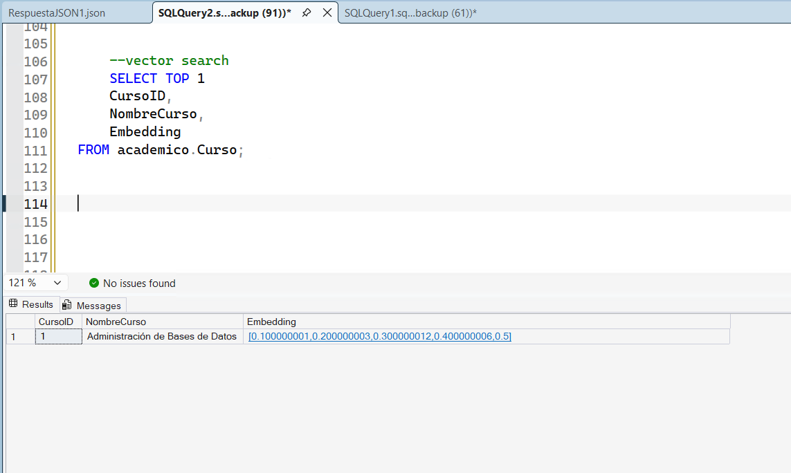
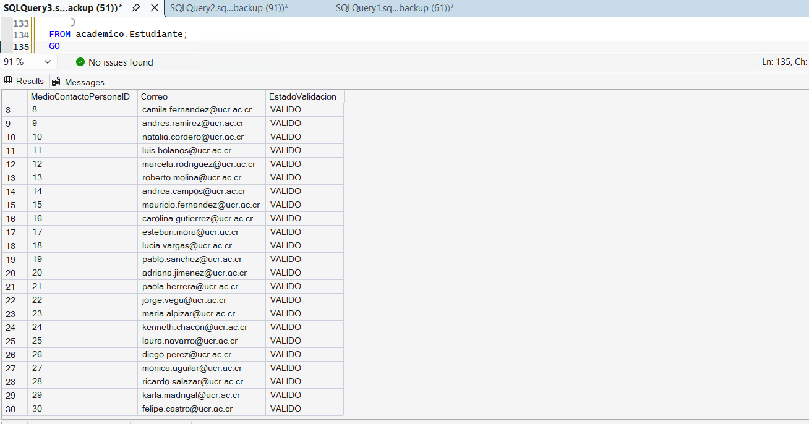
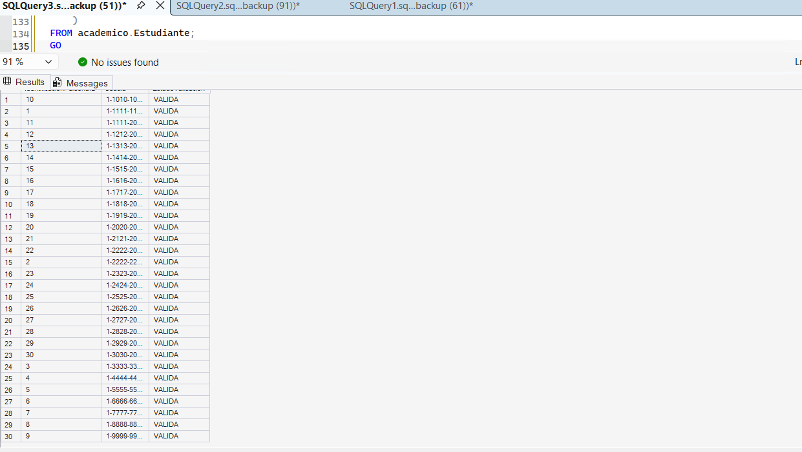
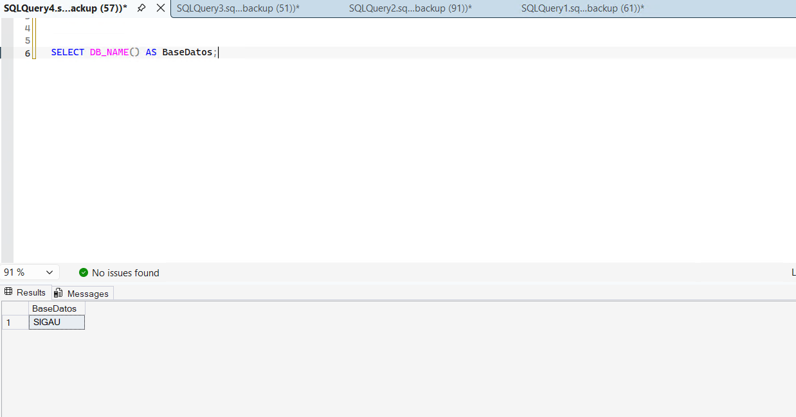

# Evidencias del Proyecto SIGAU

Este documento centraliza las evidencias generadas durante la implementación del proyecto.

## Infraestructura Azure

### Distribución de unidades

Evidencia de las unidades configuradas para separar datos, logs, TempDB, backups y auditoría.

### Usuarios locales

Evidencia de usuarios locales configurados en la máquina virtual.

### Grupo Administrators

Evidencia de los usuarios con privilegios administrativos.

## SQL Server

### Distribución de filegroups y archivos físicos

Evidencia de la separación de archivos MDF, NDF, LDF y Memory Optimized.

### Recovery Model FULL

Evidencia de que SIGAU utiliza modelo de recuperación FULL.

### SQL Server 2025 instalado

Evidencia de versión y edición del motor instalado.

## Auditoría

### Server Audit

Evidencia de auditoría de servidor configurada.

### Database Audit Specification

Evidencia de especificación de auditoría configurada sobre la base SIGAU.

## Seguridad

### Dynamic Data Masking

Demuestra que cédulas, direcciones y correos se presentan enmascarados para usuarios con permisos limitados.

### Row Level Security

Demuestra filtrado de registros por sede.

### Hardening CIS Windows Server 2025

- [Reporte CSV](../04_evidencias/Seguridad/CIS_WS2025/CIS_WS2025_Verification_20260428_172121.csv)
- [Resumen TXT](../04_evidencias/Seguridad/CIS_WS2025/CIS_WS2025_Verification_20260428_172121.txt)

## Población de datos

### Conteo de registros por tabla

Demuestra que todas las tablas poseen al menos 10 registros.

## Serialización JSON

Demuestra la generación de salida JSON desde SQL Server.

## Backup y Restore

### Backup completo

Backup completo de SIGAU almacenado en la unidad H.

### Restore de prueba

Restauración completa en la base SIGAU_RESTORE_TEST.

## Funcionalidades Modernas

### REST API

Demuestra el consumo de servicios REST externos mediante sp_invoke_external_rest_endpoint, utilizando JSONPlaceholder y obteniendo una respuesta HTTP 200 satisfactoria.

### Vector Search

Demuestra el almacenamiento de embeddings mediante el tipo VECTOR y la búsqueda semántica utilizando distancia vectorial sobre los cursos registrados en SIGAU.

### Expresiones Regulares Avanzadas

Demuestra el uso de REGEXP_LIKE para validar correos electrónicos, números de identificación y carnés universitarios utilizando las capacidades nativas de SQL Server 2025.

## Azure SQL Database PaaS

### Implementación en Azure SQL Database

Demuestra la ejecución de SIGAU sobre Azure SQL Database, validando la conexión al servicio, la existencia de los datos y la ejecución correcta de consultas sobre la plataforma PaaS.

