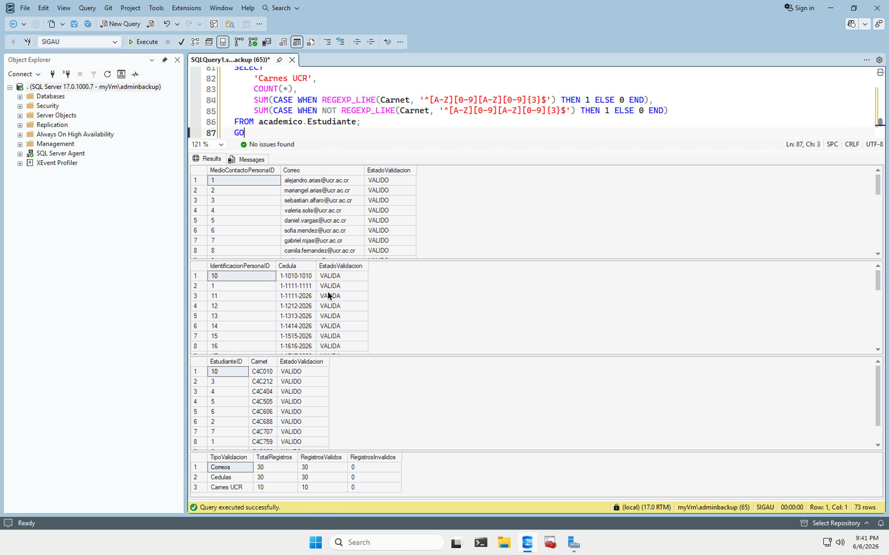

# Expresiones Regulares Avanzadas

## Objetivo

Implementar validaciones mediante expresiones regulares avanzadas en SQL Server 2025 para controlar formatos de datos sensibles y académicos dentro de SIGAU.

## Implementación

Se desarrolló el script:

- [02_Regex_Avanzado.sql](../03_sql/07_validaciones/02_Regex_Avanzado.sql)

El script utiliza la función `REGEXP_LIKE()` de SQL Server 2025 para validar información almacenada en tablas del sistema.

## Tablas validadas

| Tabla | Campo | Validación |
|---------|---------|---------|
| core.MedioContactoPersona | ValorContacto | Correos electrónicos |
| core.IdentificacionPersona | NumeroIdentificacion | Cédulas nacionales |
| academico.Estudiante | Carnet | Carnés universitarios |

## Expresiones utilizadas

### Correos electrónicos

```regex
^[A-Za-z0-9._%+-]+@[A-Za-z0-9.-]+\.[A-Za-z]{2,}$
```

### Cédulas nacionales

```regex
^[1-9]-?[0-9]{4}-?[0-9]{4}$
```

### Carnés universitarios

```regex
^[A-Z][0-9][A-Z][0-9]{3}$
```

## Resultado de las validaciones

| Tipo de validación | Total registros | Válidos | Inválidos |
|---------|---------:|---------:|---------:|
| Correos electrónicos | 30 | 30 | 0 |
| Cédulas nacionales | 30 | 30 | 0 |
| Carnés universitarios | 10 | 10 | 0 |

Todas las validaciones ejecutadas sobre los datos de prueba de SIGAU produjeron resultados válidos.

## Evidencias

### Ejecución de validaciones Regex



Archivo de evidencia:

- [01_Validacion_Regex_Avanzado.jpeg](../04_evidencias/Regex/01_Validacion_Regex_Avanzado.jpeg)

## Archivos relacionados

### Scripts

- [02_Regex_Avanzado.sql](../03_sql/07_validaciones/02_Regex_Avanzado.sql)
- [01_Pruebas_Finales.sql](../03_sql/07_validaciones/01_Pruebas_Finales.sql)

### Documentación

- [Modelo_Datos.md](Modelo_Datos.md)
- [Seguridad.md](Seguridad.md)
- [Checklist_Rubrica.md](Checklist_Rubrica.md)
