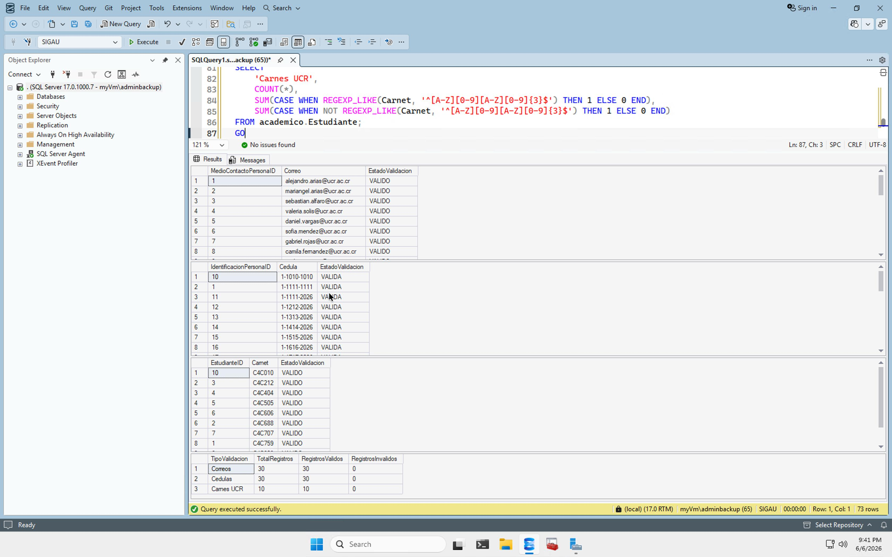

# Expresiones Regulares Avanzadas

## Objetivo

Implementar validaciones persistentes mediante expresiones regulares de SQL Server 2025 para controlar formatos de datos sensibles y académicos dentro de SIGAU.

## Implementación

Las expresiones regulares no se utilizan únicamente en consultas de verificación.

Actualmente se encuentran implementadas como restricciones `CHECK` reales dentro de la base de datos.

## Restricciones implementadas

| Restricción | Tabla | Columna |
|---|---|---|
| `CK_MedioContactoPersona_Email_Formato` | `core.MedioContactoPersona` | `ValorContacto` |
| `CK_IdentificacionPersona_Formato` | `core.IdentificacionPersona` | `NumeroIdentificacion` |
| `CK_Estudiante_Carnet_Formato` | `academico.Estudiante` | `Carnet` |

Las tres restricciones fueron verificadas con los siguientes valores:

- `is_disabled = 0`
- `is_not_trusted = 0`

Esto confirma que las restricciones están activas y que SQL Server confía en su validación.

## Formatos controlados

### Correo electrónico

Expresión utilizada:

    ^[A-Za-z0-9._%+-]+@[A-Za-z0-9.-]+\.[A-Za-z]{2,}$

La validación se aplica cuando `TipoMedioContactoID = 1`.

### Identificación nacional

Expresión utilizada:

    ^[1-9]-?[0-9]{4}-?[0-9]{4}$

Ejemplos válidos:

- `1-1010-1010`
- `110101010`

### Carné universitario

Expresión utilizada:

    ^[A-Z][0-9][A-Z][0-9]{3}$

Ejemplo válido:

- `C4C010`

## Resultado de las validaciones

| Validación | Registros | Válidos | Inválidos |
|---|---:|---:|---:|
| Correos electrónicos | 30 | 30 | 0 |
| Identificaciones | 30 | 30 | 0 |
| Carnés | 10 | 10 | 0 |

Todos los registros actuales cumplen con los formatos definidos.

## Scripts relacionados

- [02_Regex_Avanzado.sql](../03_sql/07_validaciones/02_Regex_Avanzado.sql)
- [01_SIGAU_CreacionBD_v1_0.sql](../03_sql/01_creacion/01_SIGAU_CreacionBD_v1_0.sql)
- [01_Pruebas_Finales.sql](../03_sql/07_validaciones/01_Pruebas_Finales.sql)

## Evidencias

- [01_Validacion_Regex_Avanzado.jpeg](../04_evidencias/Regex/01_Validacion_Regex_Avanzado.jpeg)
- [SIGAU_Esquema_Real_VM.sql](../04_evidencias/SQLServer/SIGAU_Esquema_Real_VM.sql)

## Estado

Implementado mediante restricciones `CHECK`, activo y verificado en la VM.