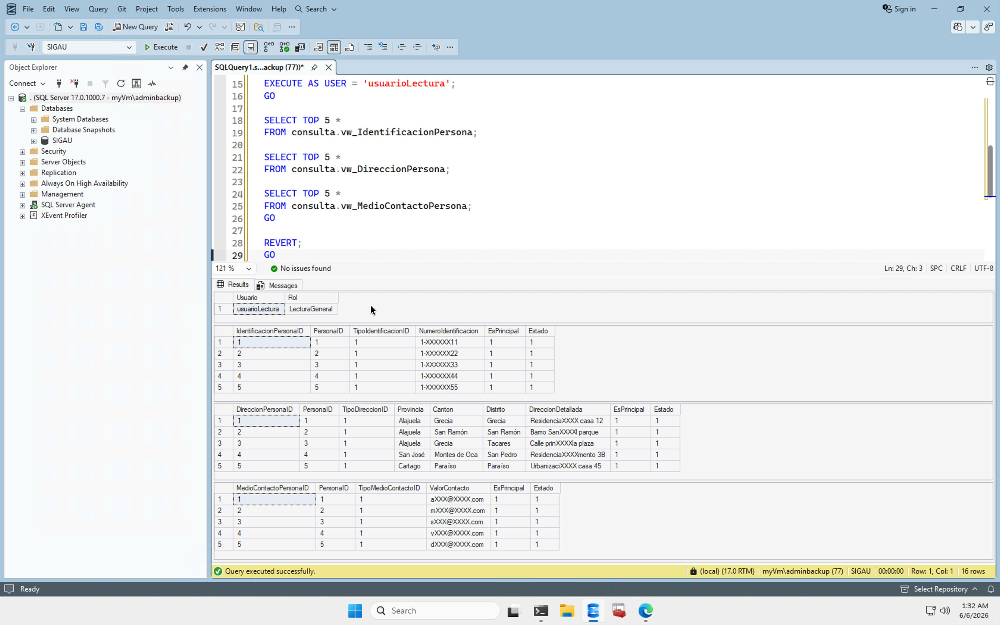
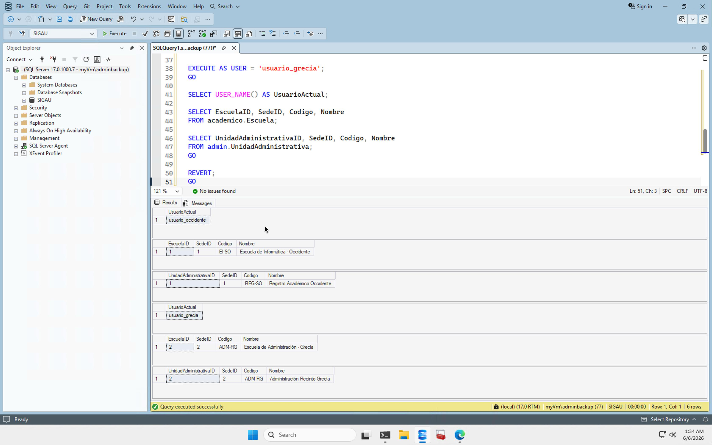

# Seguridad del Proyecto SIGAU

## Objetivo

La seguridad de SIGAU se diseñó aplicando separación de responsabilidades, control de acceso por roles, protección de datos sensibles, auditoría y reducción de superficie de exposición.

## Autenticación

SQL Server fue configurado en modo Windows Authentication únicamente. Esto reduce el uso de credenciales SQL internas y centraliza el acceso mediante cuentas del sistema operativo.

## Cuentas administrativas

Cuenta operativa utilizada:

- myVm\adminbackup

La cuenta original `sigauadmin` fue deshabilitada posteriormente como medida de reducción de exposición.

## Cuentas de servicio

SQL Server utiliza cuentas dedicadas:

- sqlsvc
- sqlagent

Esto separa servicios del motor de cuentas administrativas humanas.

## Roles de base de datos

Se crearon tres roles personalizados para separar las responsabilidades y evitar la lectura directa de las tablas base.

Las consultas se realizan mediante las vistas del esquema `consulta`.

### Administrativo

Permisos efectivos:

- `SELECT` sobre el esquema `consulta`
- `INSERT`, `UPDATE` y `DELETE` sobre `core`
- `INSERT`, `UPDATE` y `DELETE` sobre `academico`
- `INSERT`, `UPDATE` y `DELETE` sobre `admin`
- `INSERT`, `UPDATE` y `DELETE` sobre `seguridad`
- `INSERT`, `UPDATE` y `DELETE` sobre `api`
- `EXECUTE` sobre el esquema `api`
- `UNMASK` a nivel de base de datos

Este rol puede consultar la información mediante vistas y visualizar los valores reales de las columnas protegidas mediante Dynamic Data Masking.

No recibe un permiso directo de `SELECT` sobre los esquemas que contienen las tablas base.

### Mantenimiento

Permisos efectivos:

- `SELECT` sobre el esquema `consulta`
- `INSERT`, `UPDATE` y `DELETE` sobre `core`
- `INSERT`, `UPDATE` y `DELETE` sobre `academico`
- `INSERT`, `UPDATE` y `DELETE` sobre `admin`
- `INSERT`, `UPDATE` y `DELETE` sobre `api`
- `EXECUTE` sobre el esquema `api`

Este rol no posee el permiso `UNMASK`.

Tampoco recibe permisos de escritura sobre el esquema `seguridad`, por lo que no puede modificar los mapeos utilizados por Row-Level Security.

No recibe un permiso directo de `SELECT` sobre las tablas base.

### LecturaGeneral

Permisos efectivos:

- `SELECT` sobre el esquema `consulta`

Restricciones explícitas:

- `DENY SELECT, INSERT, UPDATE, DELETE` sobre `core`
- `DENY SELECT, INSERT, UPDATE, DELETE` sobre `academico`
- `DENY SELECT, INSERT, UPDATE, DELETE` sobre `admin`
- `DENY SELECT, INSERT, UPDATE, DELETE` sobre `api`
- `DENY SELECT, INSERT, UPDATE, DELETE` sobre `seguridad`

Este rol consulta únicamente mediante las vistas del esquema `consulta`.

## Verificación de permisos

Las pruebas realizadas en la VM confirmaron que `usuario_grecia`, miembro de `LecturaGeneral`, puede consultar:

- `consulta.vw_Escuela`
- `consulta.vw_UnidadAdministrativa`

Al intentar consultar directamente `academico.Escuela`, SQL Server devolvió el error `229` por falta de permiso.

Esto confirma que la lectura mediante vistas funciona y que el acceso directo a las tablas base está bloqueado.

## Script relacionado

- [01_Roles.sql](../03_sql/03_seguridad/01_Roles.sql)

## Dynamic Data Masking

Columnas protegidas:

| Tabla | Columna | Función |
|---|---|---|
| core.IdentificacionPersona | NumeroIdentificacion | partial |
| core.DireccionPersona | DireccionDetallada | partial |
| core.MedioContactoPersona | ValorContacto | email |
| core.Sede | DireccionReferencia | partial |

Evidencia:

## Row Level Security

La seguridad a nivel de fila limita la información visible según la sede asignada al usuario de base de datos.

## Objetos utilizados

- `seguridad.UsuarioSede`
- `seguridad.fn_FiltroSede`
- `seguridad.Policy_EscuelaPorSede`
- `seguridad.Policy_UnidadPorSede`

## Funcionamiento

La tabla `seguridad.UsuarioSede` relaciona cada usuario con una o más sedes.

La función `seguridad.fn_FiltroSede` permite el acceso cuando:

- el usuario actual es `dbo`; o
- existe una asignación activa entre `USER_NAME()` y el `SedeID` consultado.

Las políticas aplican el filtro sobre:

- `academico.Escuela`
- `admin.UnidadAdministrativa`

Ambas políticas se encuentran activas con `STATE = ON`.

## Usuarios y sedes verificadas

| Usuario | SedeID | Resultado |
|---|---:|---|
| `usuario_occidente` | 1 | Solo visualiza información de Occidente |
| `usuario_grecia` | 2 | Solo visualiza información de Grecia |
| `usuario_tacares` | 3 | Asignación registrada |
| `usuario_rodrigo_facio` | 4 | Asignación registrada |
| `usuario_caribe` | 5 | Asignación registrada |
| `usuario_guanacaste` | 6 | Asignación registrada |
| `usuario_pacifico` | 7 | Asignación registrada |

La cuenta `adminbackup` conserva asignaciones activas para las sedes 1, 2 y 3.

## Verificación funcional

La prueba realizada como `usuario_grecia` mostró únicamente:

- Escuela con `SedeID = 2`
- Unidad administrativa con `SedeID = 2`

La prueba realizada como `usuario_occidente` mostró únicamente:

- Escuela con `SedeID = 1`
- Unidad administrativa con `SedeID = 1`

La consulta de duplicados sobre `seguridad.UsuarioSede` no devolvió filas.

## Repetibilidad del script

El script elimina las políticas existentes antes de modificar la función de filtrado y posteriormente las crea de nuevo.

Este orden evita conflictos por `SCHEMABINDING` y permite ejecutar el script nuevamente sin duplicar los mapeos de usuario y sede.

## Scripts relacionados

- [01_Roles.sql](../03_sql/03_seguridad/01_Roles.sql)
- [02_RLS.sql](../03_sql/03_seguridad/02_RLS.sql)

## Evidencia

## Auditoría

Se configuró auditoría a nivel de servidor y base de datos.

Objetos:

- Audit_SIGAU_Server
- Audit_SIGAU_Database

Ruta:

H:\SQLServer\Audit\SIGAU\

Eventos auditados:

- SELECT
- INSERT
- UPDATE
- DELETE
- Cambios de objetos
- Cambios de permisos
- Cambios de principales

## Bitácora In-Memory

Tabla:

- seguridad.BitacoraAcceso

Configuración:

- MEMORY_OPTIMIZED = ON
- DURABILITY = SCHEMA_AND_DATA

## Hardening SQL Server

Configuraciones de reducción de superficie:

| Configuración | Valor |
|---|---|
| Ad Hoc Distributed Queries | 0 |
| clr enabled | 0 |
| clr strict security | 1 |
| cross db ownership chaining | 0 |
| Database Mail XPs | 0 |
| Ole Automation Procedures | 0 |
| remote access | 0 |
| remote admin connections | 0 |
| scan for startup procs | 0 |

La opción `external rest endpoint enabled` se habilitó como excepción controlada porque el proyecto requiere consumo de API REST desde SQL Server.

## Hardening Windows

El hardening del sistema operativo se documenta en:

- [Hardening CIS Windows Server](../06_azure/Hardening_CIS.md)

Evidencias:

- [Reporte CSV CIS](../04_evidencias/Seguridad/CIS_WS2025/CIS_WS2025_Verification_20260428_172121.csv)
- [Resumen TXT CIS](../04_evidencias/Seguridad/CIS_WS2025/CIS_WS2025_Verification_20260428_172121.txt)

## Documentación relacionada

- [Hardening SQL Server](Hardening_SQL_Server.md)
- [Antimalware SQL Server](Antimalware_SQL_Server.md)
- [Hardening CIS Windows Server](../06_azure/Hardening_CIS.md)