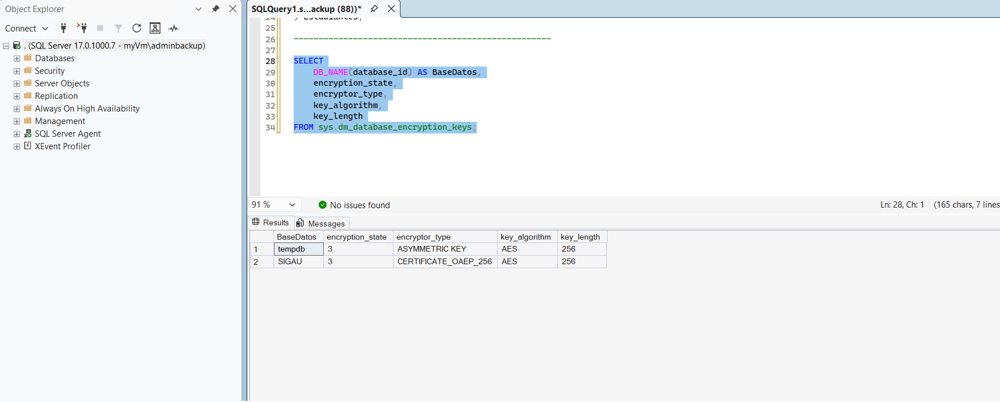
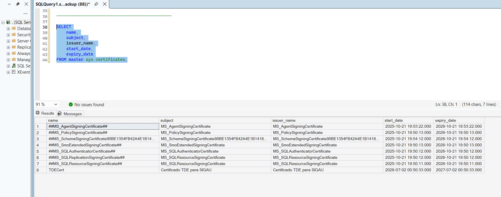

# Transparent Data Encryption (TDE)

## Descripción

Transparent Data Encryption (TDE) protege los archivos físicos de la base de datos mediante cifrado automático, evitando el acceso no autorizado a la información almacenada en disco. Esta característica cifra los archivos de datos y de transacciones sin requerir modificaciones en las aplicaciones que utilizan la base de datos.

## Implementación en SIGAU

La base de datos **SIGAU** utiliza Transparent Data Encryption (TDE) para proteger la información almacenada, garantizando que los archivos de la base permanezcan cifrados incluso si son copiados o extraídos del servidor.

## Algoritmo utilizado

- **Algoritmo:** AES-256
- **Protección de la Database Encryption Key:** Certificado almacenado en la base de datos `master`.

## Evidencias

### Estado del cifrado

La evidencia demuestra que la base de datos **SIGAU** se encuentra cifrada mediante Transparent Data Encryption y que el estado de cifrado es correcto.

### Certificado utilizado

El certificado **TDECert** almacenado en la base de datos `master` protege la **Database Encryption Key (DEK)** utilizada por Transparent Data Encryption.

### Respaldo del certificado

> El respaldo del certificado constituye una buena práctica para facilitar la recuperación de bases de datos cifradas en caso de migración o desastre. Su documentación se encuentra en proceso de incorporación.

<!-- Cuando tengas la evidencia, descomenta la siguiente línea -->

<!--

-->

## Resultado

La implementación de Transparent Data Encryption permite que los archivos físicos de la base de datos permanezcan protegidos mediante cifrado AES-256, incrementando la seguridad de la información almacenada y cumpliendo con las buenas prácticas de administración de bases de datos.
