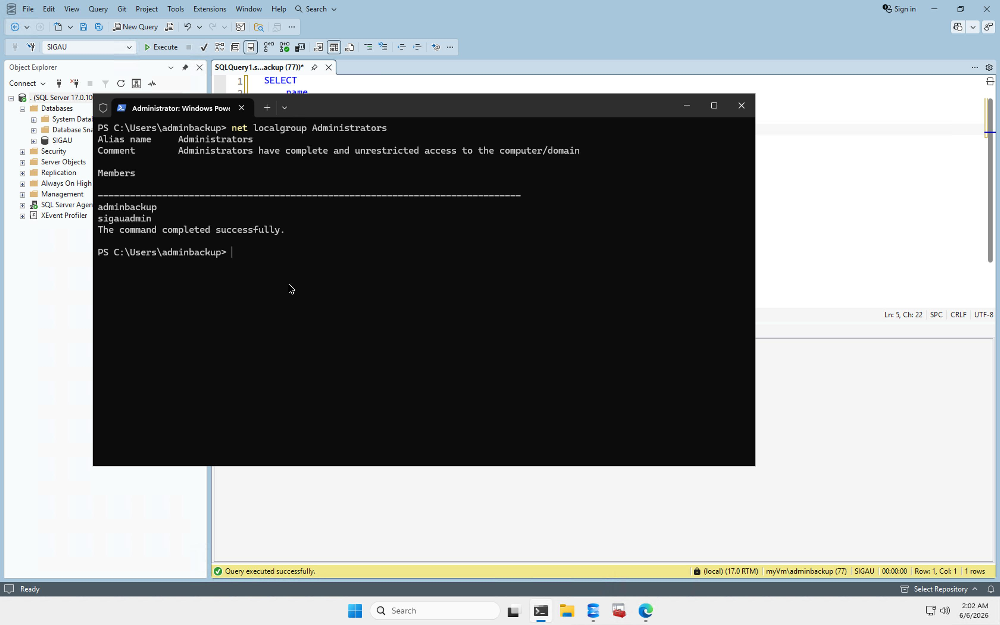

# Configuración de la Máquina Virtual

## Plataforma

La infraestructura del proyecto SIGAU fue implementada sobre una máquina virtual en Microsoft Azure con Windows Server 2025 como sistema operativo base.

## Servidor

Nombre del servidor:

myVm

## Usuario operativo

Cuenta utilizada para administración:

myVm\adminbackup

Esta cuenta se creó para evitar el uso continuo del usuario administrativo original.

## Usuarios locales relevantes

- adminbackup: usuario operativo principal.
- sigauadmin: usuario administrativo original, actualmente deshabilitado.
- sqlsvc: cuenta de servicio de SQL Server.
- sqlagent: cuenta de servicio de SQL Server Agent.
- ProjectDB_Guest: usuario invitado deshabilitado.
- DefaultAccount: cuenta integrada deshabilitada.
- WDAGUtilityAccount: cuenta integrada deshabilitada.

Evidencia:

## Grupos locales

### Administrators

Miembros identificados:

- adminbackup
- sigauadmin

Evidencia:

### Remote Desktop Users

Miembros identificados:

- adminbackup

## Criterio aplicado

El usuario `adminbackup` permite administrar la máquina mediante RDP sin depender del usuario inicial de aprovisionamiento. La cuenta `sigauadmin` se mantiene deshabilitada para reducir superficie de exposición.

No se documentan contraseñas ni credenciales dentro del repositorio.
