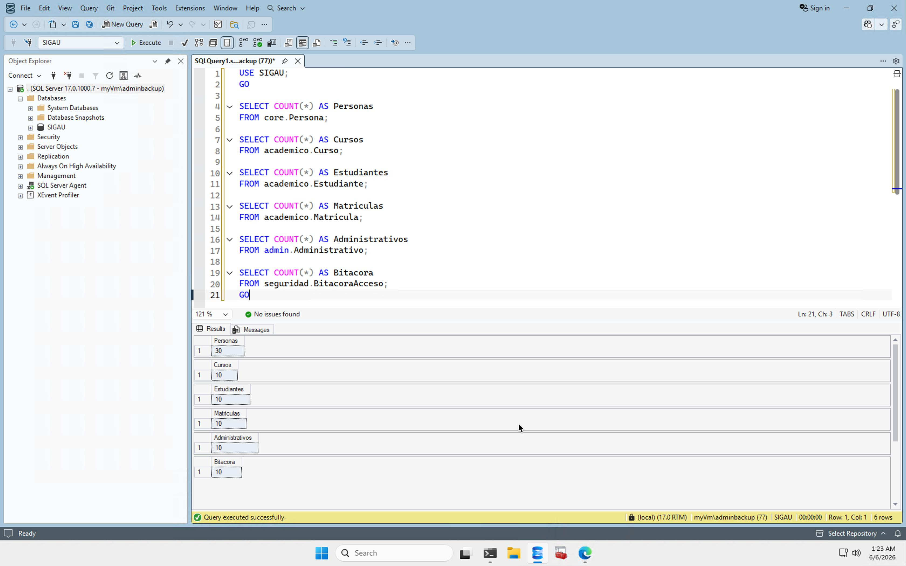
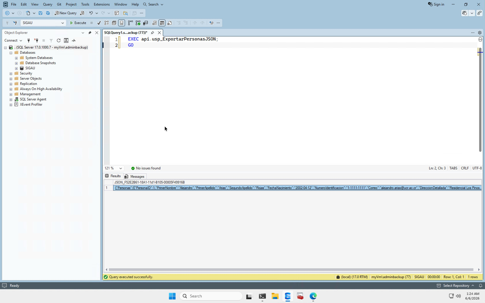
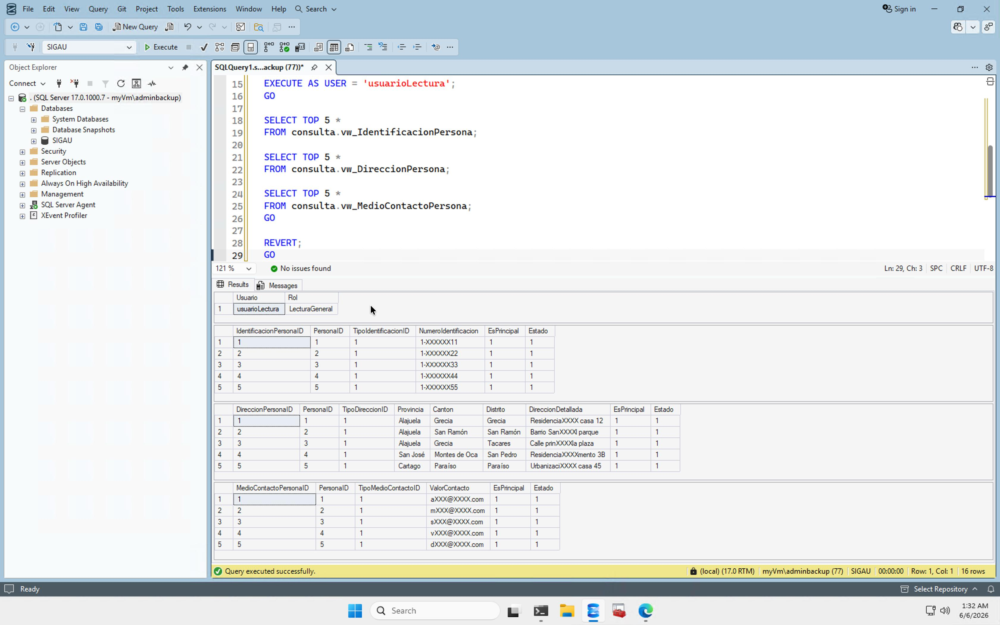
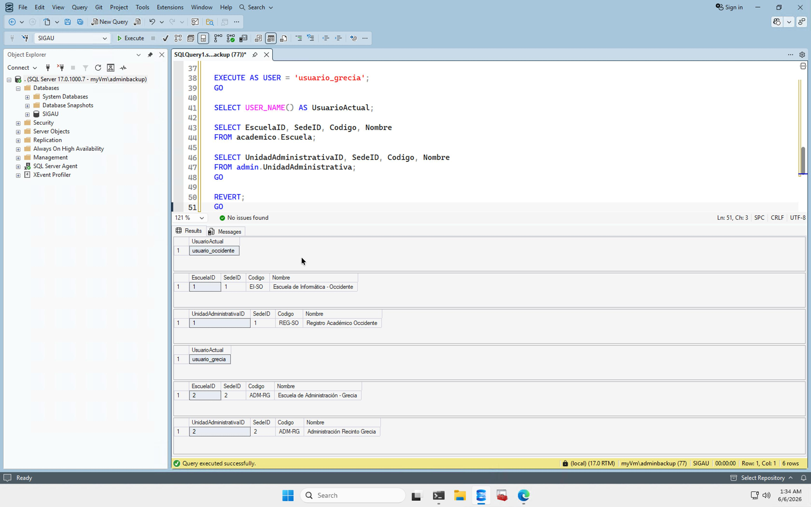
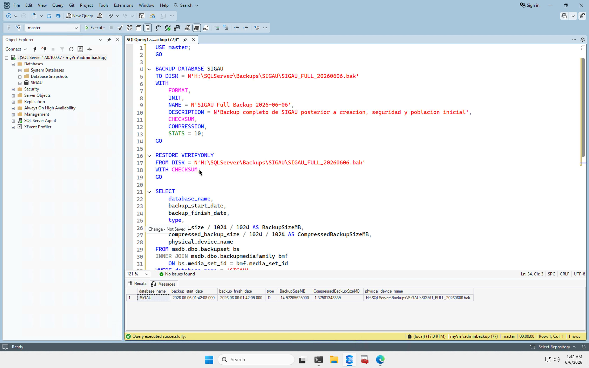
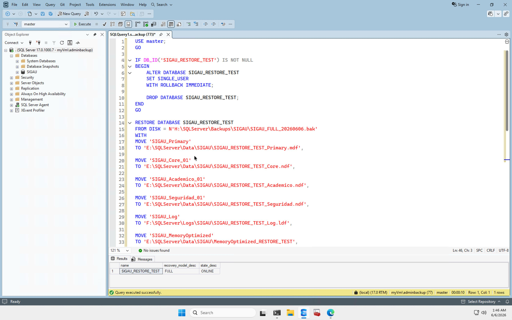

# SIGAU

Sistema Integral de Gestión Académica Universitaria

Proyecto Final - IF-5100 Administración de Bases de Datos  
Universidad de Costa Rica - Sede de Occidente  
I Ciclo 2026

## Integrantes

- Alejandro Arias Rojas (C4C759)
- Mariangel Arias Alfaro (C4C688)
- Sebastián Alfaro Arias (C4C212)

## Descripción

SIGAU es una solución de gestión académico-administrativa universitaria desarrollada sobre Microsoft SQL Server 2025. El sistema centraliza personas, estudiantes, profesores, sedes, escuelas, planes de estudio, cursos, matrícula, historial académico, nombramientos y unidades administrativas.

El proyecto incorpora seguridad, auditoría, administración física del almacenamiento, recuperación ante fallos y funcionalidades modernas de SQL Server 2025.

## Objetivo del proyecto

Aplicar mejores prácticas de administración de bases de datos mediante un ecosistema seguro, auditado, respaldado y organizado según estándares internacionales y criterios vistos en el curso IF-5100.

## Tecnologías utilizadas

- Microsoft Azure
- Windows Server 2025 Datacenter
- SQL Server 2025 Enterprise Evaluation
- SQL Server Management Studio
- SQL Server Audit
- In-Memory OLTP
- Dynamic Data Masking
- Row Level Security
- JSON
- External REST API Calls
- Vector Data and Semantic Search

## Estándares aplicados

- [CIS Microsoft Windows Server 2025 Benchmark v2.0.0](01_enunciado/CIS_Windows_Server_2025_Benchmark_v2_0_0.pdf)
- [CIS Microsoft SQL Server 2022 Benchmark v1.2.1](01_enunciado/CIS_SQL_Server_2022_Benchmark_v1_2_1.pdf)

## Documentación

- [Modelo de datos](02_documentacion/Modelo_Datos.md)
- [Seguridad](02_documentacion/Seguridad.md)
- [Evidencias](02_documentacion/Evidencias.md)
- [Checklist de rúbrica](02_documentacion/Checklist_Rubrica.md)
- [Estructura del repositorio](02_documentacion/Estructura_Repositorio.txt)
- [Azure SQL Database](02_documentacion/Azure_SQL_Database.md)
- [Vector Search](02_documentacion/Vector_Search.md)
- [External API Calls](02_documentacion/External_API_Calls.md)
- [Expresiones Regulares](02_documentacion/Regex_Avanzado.md)
- [Hardening SQL Server](02_documentacion/Hardening_SQL_Server.md)
- [Antimalware SQL Server](02_documentacion/Antimalware_SQL_Server.md)

## Azure e infraestructura

- [Configuración de VM](06_azure/Configuracion_VM.md)
- [Discos y LUNs](06_azure/Discos.md)
- [Hardening CIS Windows Server](06_azure/Hardening_CIS.md)
- [Scripts de hardening](06_azure/hardening_scripts)

## Scripts SQL

### Creación

- [Creación de SIGAU](03_sql/01_creacion/01_SIGAU_CreacionBD_v1_0.sql)

### Población

- [Datos maestros](03_sql/02_poblacion/01_DatosMaestros.sql)
- [Datos académicos](03_sql/02_poblacion/02_DatosAcademicos.sql)
- [Datos administrativos](03_sql/02_poblacion/03_DatosAdministrativos.sql)

### Seguridad

- [Roles](03_sql/03_seguridad/01_Roles.sql)
- [Row Level Security](03_sql/03_seguridad/02_RLS.sql)
- [Dynamic Data Masking](03_sql/03_seguridad/03_DynamicDataMasking.sql)

### Auditoría

- [Auditoría](03_sql/04_auditoria/01_Audit_SIGAU.sql)

### Backup y Restore

- [Backup completo](03_sql/05_backup_restore/01_Backup_Completo.sql)
- [Restore de prueba](03_sql/05_backup_restore/02_Restore.sql)

### Funcionalidades modernas

- [JSON](03_sql/06_json_api_vector/01_JSON.sql)
- [REST API](03_sql/06_json_api_vector/02_REST_API.sql)
- [Vector Search](03_sql/06_json_api_vector/03_VectorSearch.sql)

## Evidencias principales

### Población

### JSON

### Dynamic Data Masking

### Row Level Security

### Backup

### Restore

## Distribución de almacenamiento

| Unidad | Propósito |
|---|---|
| E: | MDF, NDF e In-Memory |
| F: | Transaction Logs |
| G: | TempDB |
| H: | Backups y Auditoría |

## Estado actual

| Componente | Estado |
|---|---|
| Infraestructura Azure | Implementado |
| Windows Server 2025 | Implementado |
| SQL Server 2025 | Implementado |
| Hardening Windows | Implementado |
| Arquitectura de datos | Implementado |
| Filegroups y LUNs | Implementado |
| In-Memory OLTP | Implementado |
| Población de datos | Implementado |
| Roles | Implementado |
| Dynamic Data Masking | Implementado |
| Row Level Security | Implementado |
| Auditoría SQL | Implementado, falta evidencia visual adicional |
| Backup completo | Implementado |
| Restore de prueba | Implementado |
| JSON | Implementado |
| REST API | En proceso |
| Vector Search | En proceso |
| Azure SQL Database PaaS | Pendiente |
